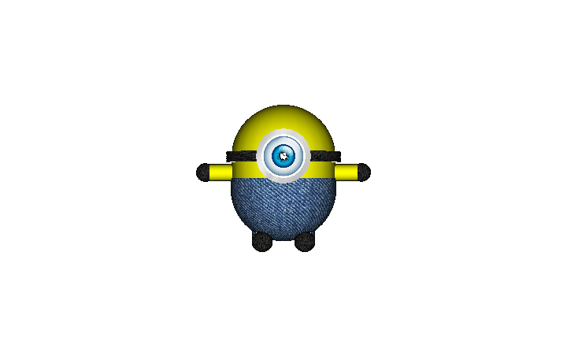
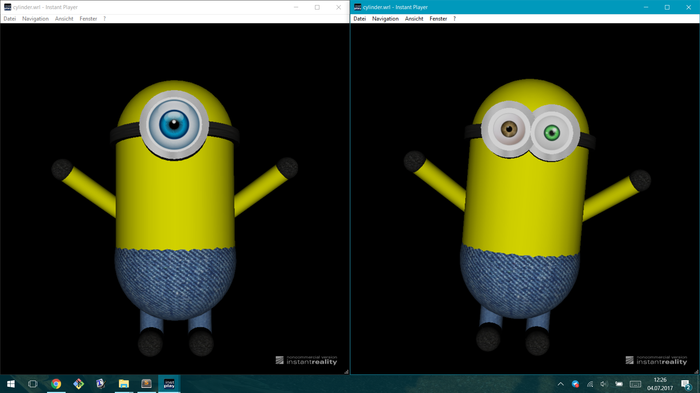
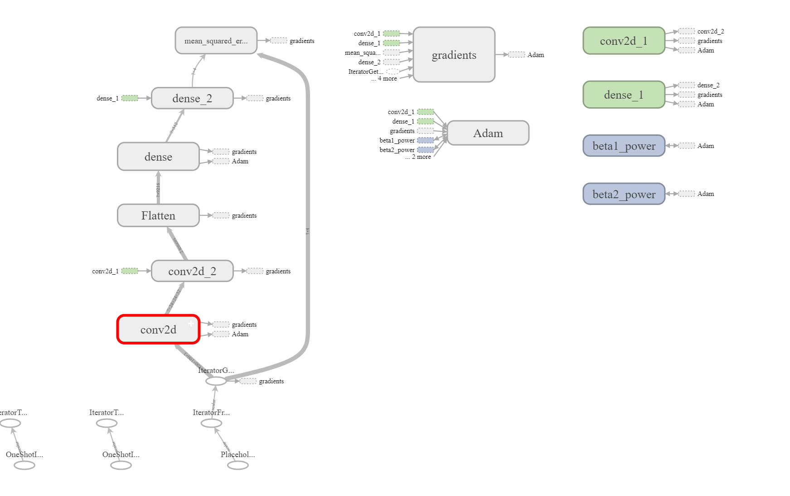
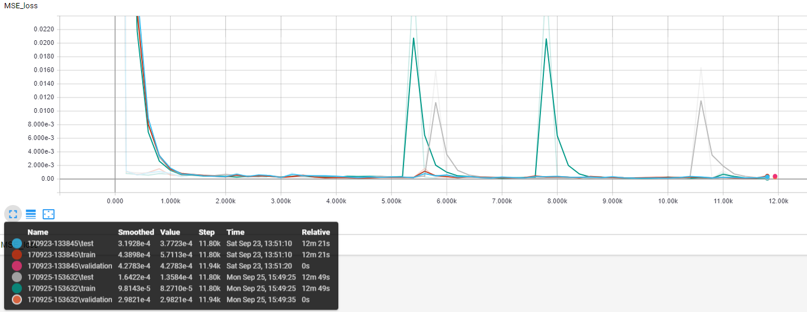
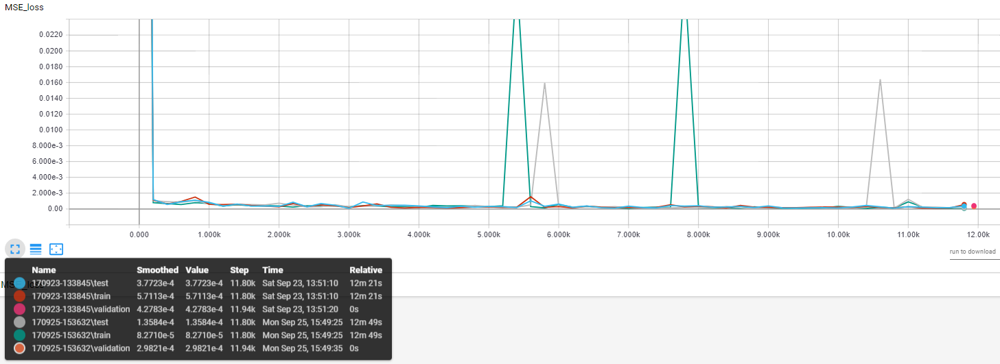
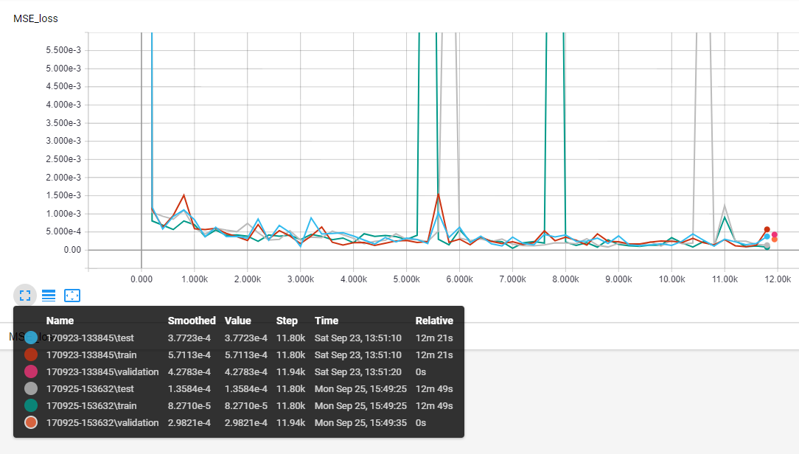
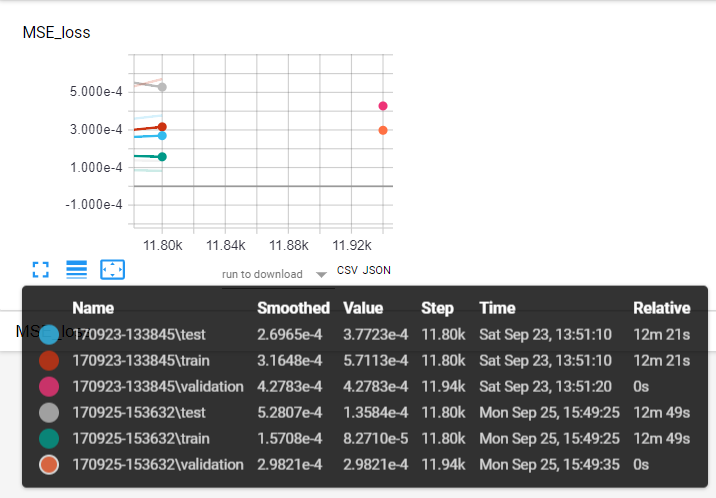

---
title: Generating my own Minion
author: Ann-Christin Meisener \linebreak  September 23, 2017
date: Project Report \linebreak ANNs for depth estimation, 3D reconstruction and 3D printing
documentclass: scrartcl
...

\newpage

# Introduction

Using artificial neuronal networks (ANNs) has been proven as a powerfull tool for the reconstruction or classification of 3D objects from 2D images [@Wu2016, @Su2015]. Training ANNs on big datasets like ModelNet or ShapeNet, trying to generalize the deep learning model in such a way, that they perform reasonably on new, untrained data is up to date the pursued goal. 
With the intend to personally get hands on experience in this area and to understand the complexity of this subject, this project was drafted.

As it is pointed out in many papers concerning the modeling of object recongition and reconstruction, the data acquisition is a real issue. Either one takes already existing datasets as the ones mentioned above or one has to generate an own dataset. The latter is a great deal of extra efford, which can be tremendous if generation processes are not at least partly automatized. For this project the dataset was chosen to be self-made. At the very beginning, the main idea had been to collect data from "Despicable Me" and related movies like "Minions", in form of screenshots displaying minions, which do represent the little privat army of the main character in this movie series. Further, it was planed to train a network that based on these images, generates 3D versions of these tiny yellow footmen. 

Unfortunately, the first intend of data acquisition was lacking in sufficient 3D examples to learn from. Thus, means were investigated to produce 3D minion models. Finally, the *Virtual Reality Modeling Language (VRML)* was chosen as the tool to create 3D representations of minions. These representations, in many variations, were later automately generated. Image samples and respective feature informations, which make up for the variations, were saved as a basic dataset. The hence established data was then structually preprocessed to be feed into a neuronal network. To implement the ANN, *Tensorflow 1.6.0* was used and *Tensorflow's Tensorboard* for adequate visualisations. The neuronal network was designed in such a way, that it was required to learn varying features from minion images.

The results are quite interesting as some features are being perfectly recognized and described by the network, while it distinctively performs poor on other features. This as well as further opportunities the developed dataset provides will be discussed at the end of this project report.

# Data Acquisition

## Template Creation

To create a 3D instance of a minion I used the script language *VRML*, which basically works by descriping object shapes in a virtual space located around a center point. These objects can be rotated, resized and colored. A minion consisted for example of a cylinder for the body and two circles for the head and bottom, as well as several cylinders and circles for arms, hands, legs, shoes and goggles. Every object was given a color in RGB or a texture loaded from image files. The latter even made it possible to give the minions genuine eyes. This for example is a *VRML* code snippet from the minion template that initializes the goggle band.

```VRML
    # A goggle band
    Transform
    {
        translation 0 0 0
        children
        [
            Shape 
            {
                appearance Appearance 
                {
                    material Material 
                    {
                    #    diffuseColor 0 0 0
                    }
                    texture ImageTexture
                    {
                        url "leather.jpg"
                    }
                }
                geometry Cylinder 
                {
                    height 0.1 
                    radius 0.55
                }
            }
        ]
    }
```

To visualize the minion during the creation process I used the non-commercial version of the *Instant player* from [*InstantReality*](http://www.instantreality.org/). In Figure 1 one can see the first minion I designed in *VRML*:

 

## Generation Automization

Now to create a little minion army, I found out that the VRML scripting language is of no use, as it does not allow for any form of calculations at all and also the usability of variables is very limited. So I managed to outsource the minion automization using the VRML prototype function. This function makes it possible for the user to collect all the variables to manipulate in a listing at the beginning of the file with default values. 

```VRML
PROTO MinionCreator[
    # Main parameter
    field   SFVec3f one_eye     0 0 0       # default: all eyes hidden 
    field   SFVec3f two_eyes    0 0 0       # show eyes with 0 0 0.45
    
    field   SFFloat mHeight     1           # 0 < mHeight <= 1
    field   SFVec3f head        0 0.5 0     # 0  mHeight/2 0
    field   SFVec3f butt        0 -0.5 0    # 0 -mHeight/2 0
    field   SFFloat mShape      0.5         # stays fixed
    
    field   SFFloat arm_len     0.5         # float between 0.2 and 1
    field   SFVec3f left_hand   0 -0.25 0
    field   SFVec3f right_hand  0 0.25 0
    
    field   SFFloat leg_len     0.4         # float between 0 and 1 
    field   SFVec3f ankles      0 -0.2 0
    field   SFVec3f feet        0 -0.2 0.1
    field   SFVec3f toes        0 -0.2 0.2
]
```
All the variables listed are adjustable features like number of eyes, height, arm and leg length or other specigications which directly dependend on these features, e.g. their location in respect to the rest of the body and their own size. 

With a creator call at the end of the file in style of a dictionary, these variables can be all set at once. Thus, the next step was to manipulate the `MinionCreator` from outside the template file. The first attempt was done in *Python* where a string could be generated and then attached to the minion template.

```Python
MinionCreator{one_eye 0 0 0.45 mHeight 3.000000e-01 
              butt 0 -1.500000e-01 0 head 0 1.500000e-01 0 
              arm_len 3.000000e-01 left_hand 0 -1.500000e-01 0 
              right_hand 0 1.500000e-01 0 leg_len 2.000000e-01 
              ankles 0 -1.000000e-01 0 feet 0 -1.000000e-01 0.1 
              toes 0 -1.000000e-01 0.2} 
```

Further, I aimed on visualizing and most importantly saving the created minions in image files in the automization process. The python library *PyOpenGL* seemed promising at first. But it is a very old library which just did not work even with any of the older python versions it supported in the past. Hence, I switched to MatLab for the implementation of this part. A test version for students of *MathWorks'* [*Simulink 3D Animation*](https://de.mathworks.com/products/3d-animation.html) finally made it possible to fully automize the process of data generation.


```matlab
% create instance image on a canvas
this_world = vrworld(temp_file, 'new');
open(this_world);
canvas = view(this_world);
set(canvas, 'ZoomFactor', 2);
        
% crop and process (as you like) and save instance image
image = capture(canvas);
cropped_image = image(80:379,210:509,:); %crop
resized_image = imresize(cropped_image, [100 100]);
imwrite(double(resized_image)/255, 
        strcat('./simple_minion_dataset/data/minion',num2str(n),'.png'), 
        'png', 'transparency', double(resized_image(1,1,:))/255);  
    
close(canvas);
close(this_world);
delete temporary_minion.wrl;
```


The number of eyes was encoded by `0` for one eye and `1` for two eyes. With a stepsize of 0.1 and a lower and upper boundary for height, arm and leg length a small dataset was created of 2.000k minions. This amount made sense in a way that there were no more than 2.000k possible, distinct combinations anyway. Nevertheless, the dataset was generated randomly and datapoints can be identical. Images were sized 100x100x3 and saved in `.png` format while targets were saved in `.txt`, resembling a python dictionary style.


``` Text
Eyes:0
Height:0.3
Arm_Length:0.9
Leg_Length:0.2
```




# Preprocessing

The preprocessing of the image data already happened during the generation process, when the images were resized to a format of 100x100xRGB before saving. Then, using *Python 3.6*, a list was created holding all the `path/filename` informations and *Tensorflow 1.6.0* was used to read in the `.png` files when later running the ANN. 

```Python 
minion_files = 
    [("./simple_minion_dataset/data/minion%d.png" % i) for i in range(1,n_points+1)]
```

For the preprocessing of the targets, a function was implemented which reads the `.txt` files and creates a `numpy array` for each sample's target values containing the information for eyes, height, arm length and leg length. These `numpy arrays` were saved in a simple *Python* class `list` and finally saved in the variable `minion_tagets`.
The lists of minion filenames and targets were then zipped, shuffled and again unzipped to be finally divided 60-20-20 in training, test and validation data ready for an ANN to process.

# ANN
The final ANN consists of only three hidden layers, the first is a 2D convolution layer with a ReLu activation function, 32 filters and a kernel size of 5 with strides of (4,4). The second layer again does a 2D convolution with the same activation function, 64 filters, a kernel size of 5 and (2,2) striding. After flattening, a densely-connected layer with 512 units and hyperbolic tangent activation function ressembles the last hidden layer of the network. Finally, a dropout process is integrated to manipulate the input which the output layer receives. The output layer is also a densely-connected layer reducing the information content to 4 units with a sigmoid activation function.



The network was trained for 100 epochs with a batchsize of 10 samples each, a keep probability of 0.5 for the dropout layer and an Adam optimizer over the mean squared error (MSE). Every 200 training steps the loss on the training and testing data in form of a MSE was calculated for a tensorboard summary, to get an insight into the learning process of the ANN. After the training process the networks performance was tested on the validation data, even though the final network configuration was not chosen directly depending on the network's performance on the testing data. 


# Results

Overall the network's performance improved very fast. After 1.400k training steps the network reached a status of impovement saturation, where it started to fluctuate uniformly between improvment and retrogression which is most probably due to temporary overfitting.

In the following three plots one can see the course of the loss during training on testdata and training data. The plot in `Figure 4` is smoothed through the inbuild tensorboard opertation by a factor of 0.3. The unsmoothed, real values can be seen in `Figure 5` and in the `Figure 6` in even more detail. Here one can see the rapid improvement in the very beginning followed by performance fluctuations and especially some overfitting spikes. At approx 12.800k training steps the orange and magenta points indicate the loss of the final trained network on the respective validation datasets with a MSE of 0.000427 (orange) and 0.000298 (magenta). Also this can be seen in more detail in `Figure 7`, see below.









To get a better understanding of the ANN's performance, I additionally calculated the frequency of matches between the network output and the targets on the testing data during the training process and on the validation data after the completed training. For this evalutation the network output was rounded to either no decimals for the eyes category or to one decimal for the other feature categories, before being compared to the real target values using the pyton in-build function 'numpy.all()'. The mean showed that for the worse (orange) training run the network achieved to predict 75% of the validation data right. In respect, it gained a prediction frequency of 95.5% right in the better training run (magenta).
To further investigate these results, the predicition frequency was also calculated separately for the four feature categories. 

\newpage
```text
    Performance on validation data: 75 %               
    Featurewise performance on validation data:         
     eyes,  height, arm length, leg length              
     100.   100.      100.        75.5                  

    Performance on validation data: 95 %
    Featurewise performance on validation data:
     eyes,  height, arm length, leg length
      100.    100.     100.        95.5
```

It seems that the ANN had no difficulty with predicting the number of eyes, the height or arm length, while the length of the legs alone negatively impacts the network's performance.

# Discusson

So far this project only covered a fraction of what can be investigated in the field of object recognition and reconstruction. Only a small dataset of 2.000k examples was generated using the self-constructed automated data generator. A rather small network was able to detect differences in the objects' features. Highly interesting is the fact that one feature, the length of the legs, was distinctively hard to determine for the network in every new training process. This could be due to an insufficient dataset variety regarding leg length, but it could also be due to the attribute itself. In respect to the arms, which are always located in the same position and solely differing in length, the legs are not only differing in length but also varying in their location due to the dependency on the minion's body height. Maybe these facts make it difficult for a network with only three hidden layers to confidently detect the feature's characteristics.
Further investigations could aim on finding a network structure that could learn this feature as well as the current model learns other features like arm-length.

All in all I got hands on experience in the field of object recognition and an insight into the problems attached to 3D reconstruction, even though I did not get so far to implement my own 3D reconsturction. Nevertheless, the dataset generator has a great potential to create even more variegated datasets which could be used for such projects. For example, minions with different backgrounds and presented from different viewpoints could manifold the dataset. Another attempt could also be to generate a voxelization of the minions and then train the network to reconstruct these from images.

# References
